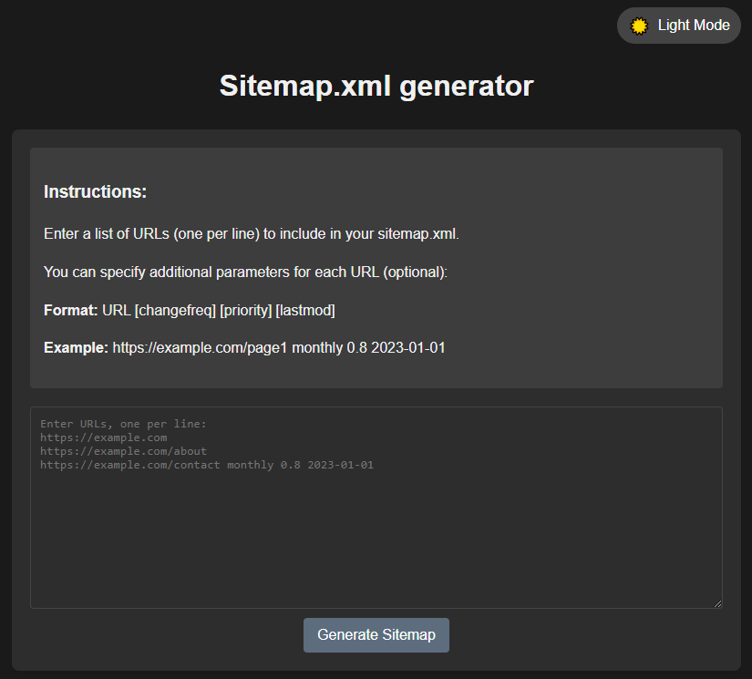

# 🌐 Sitemap.xml Generator

  
*A clean, responsive interface with dark/light theme support*

## 🚀 Main features

### 📋 Core Functionality
- **Multi-URL Processing**  
  - Add multiple URLs (one per line) with optional parameters:
    - https://example.com
    - https://example.com/about yearly
    - https://example.com/contact monthly 0.8 2023-01-01

- **Smart Validation**  
  - ✅ Real-time input checking  
  - 🚫 Disabled generate button for empty input  
  - ❗ Clear error messaging

- **Standards-Compliant Output**
```xml
<?xml version="1.0" encoding="UTF-8"?>
<urlset xmlns="http://www.sitemaps.org/schemas/sitemap/0.9">
  <url>
    <loc>https://example.com</loc>
    <changefreq>weekly</changefreq>
    <priority>0.5</priority>
    <lastmod>2023-10-15</lastmod>
  </url>
</urlset>
```

## UI/UX Features
- Auto-Theming
- 🌙 Dark / ☀️ Light mode matching OS preference
- 🔄 Manual toggle with persistent settings
- Responsive Design
- 📱 Mobile-friendly interface
- 🖥️ Optimized for desktop
- Zero-Server Operation
- 🔒 100% client-side processing
- 🌍 No external dependencies

## Usage Guide
- Enter URLs
- Paste your URLs (one per line) in the text area:
  - https://example.com/page1
  - https://example.com/page2 monthly
  - Add Parameters (optional)
  - Format: `URL [changefreq] [priority] [lastmod]`
  - Example: `https://example.com yearly 0.7 2023-06-01`
  - Generate & Download
